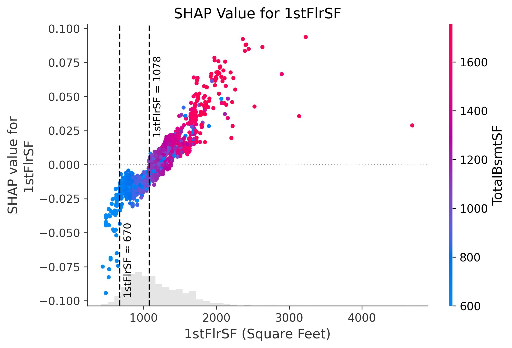

# Predict House Price in Ames, Iowa

*"Driven by a long-standing curiosity about what makes a home a great deal—or how to sell one at the best price—I set out to explore the key factors that influence housing values. In this project, I aim to develop a robust, data-driven model for predicting house prices using advanced machine learning techniques. The goal is not only to achieve accurate predictions but also to uncover meaningful insights that can empower real estate professionals, homebuyers, and sellers to make more informed decisions in a competitive market.*

# 1. Data

The Kaggle dataset [Housing Prices Competition for Kaggle Learn Users](https://www.kaggle.com/competitions/home-data-for-ml-course/overview) is divided into two parts: a training set and a testing set, each containing 1,460 records of residential home sales in Ames, Iowa. The training set includes 79 explanatory variables 

 

describing nearly every aspect of residential homes along with the target variable SalePrice, while the testing set contains 78 explanatory variables—identical in structure except for the absence of the SalePrice column.

# 2. Data Cleaning
[Data Cleaning Report](https://github.com/Sheng214/Springboard_MyProjects/blob/main/Capstone_Two/Capstone%20Two_Data%20Wrangling.ipynb)

* **Missing value cleaning** 
  -	Features with more than 50% missing values--PoolQC, Alley, MiscFeature, Fence, MasVnrType, and FireplaceQu--were removed from both the training and testing datasets.
  -	For features with less than 5% missing values, the entire records containing those missing values were removed. Similarly, five garage-related features—GarageType, GarageYrBlt, GarageFinish, GarageQual, and GarageCond—had slightly higher missing rates (under 6%) but shared the same missing pattern across records; therefore, those complete records were also removed. 
  -	LotFrontage, which had approximately 18% missing values, was imputed using predictions based on its linear relationship with 1stFlrSF.

* **Rare category combination**

  Rare categories, defined as those representing less than 1% of the training data (fewer than 13 observations), were either merged with the most similar category or grouped into a new “Other” category. To maintain consistency, rare category consolidation was based on the training set and then applied to the testing set.

* **Removing features with limited predictive relevance**

  Four categorical features—Street, Utilities, Heating, and Condition2--and four numerical features—PoolArea, 3SsnPorch, LowQualFinSF, and BsmtHalfBath--were removed due to highly imbalanced distributions (dominant category > 99% of records) and limited predictive relevance (p-Value > 0.1).

* **Categorical feature convertion**

  Among the 34 categorical features, 10 with a clear ordinal relationship were converted using ordinal encoding, while CentralAir, a binary feature, was encoded as 0/1. The remaining categorical featues were transformed using one-hot encoding. As a result, training dataset contains 1,338 records and 151 features, while the testing dataset includes 1,459 records and 150 features.

# 3. EDA
[EDA Report](https://github.com/Sheng214/Springboard_MyProjects/blob/main/Capstone_Two/Capstone%20Two_EDA.ipynb)

* **SalePrice distribution**

  The distribution is right-skewed, with a peak around 100,000–200,000, indicating that most homes in the dataset sell within this price range. As the price increases beyond 300,000, the frequency drops sharply, with very few homes selling above 500,000, suggesting that higher-priced homes are less common in this dataset.

* **Correlation Matrix Heatmap of Features with High Correlations (>0.8)**

  This heatmap visualizes the pairwise correlation coefficients between filtered features, where filtering was applied to retain only features that have at least one strong correlation (absolute value greater than 0.8 but less than 1) with another feature. 

* **Features with the Strongest Correlation to SalePrice**

  The features most strongly correlated with SalePrice include OverallQual (0.78) and GrLivArea (0.71), highlighting that overall quality and above-ground living area are key drivers of home value. 

* **Top two features with the Strongest Correlation to SalePrice**

# 4. Feature engineering
[Feature engineering Report](https://github.com/Sheng214/Springboard_MyProjects/blob/main/Capstone_Two/Capstone%20Two_Pre-processing%20and%20Training%20Data%20Development.ipynb)

All continuous and multi-level features were automatically assigned to appropriate scalers using a custom function. This function categorized features based on statistical thresholds and predefined ordinal classifications. The resulting feature groupings are summarized below:

After inspecting the distribution of each feature, the automatic classification appeared reasonable. Subsequently, each feature was scaled using the method assigned to its respective group.

# 5. Machine Learning
[Feature engineering Report](https://github.com/Sheng214/Springboard_MyProjects/blob/main/Capstone_Two/Capstone%20Two_Modeling.ipynb)

To predict SalePrice, I implemented models from three major categories: Linear Models, Random Forest, and Light Gradient Boosting Machine (LightGBM). Within each category, multiple model variants were developed using a combination of different modeling techniques, hyperparameter optimization strategies (including Grid Search, Randomized Search, and Bayesian Optimization), cross-validation schemes, and training data configurations (scaled vs. unscaled). This process resulted in a total of 12 distinct model variants.

The performance and predictive accuracy of each model were evaluated using three key metrics: R² (coefficient of determination), MAE (Mean Absolute Error), and RMSE (Root Mean Squared Error). Based on R² scores, lgbm_bay_best (highlighted in red) was selected as the best-performing model due to its highest R², lowest RMSE, and fourth-lowest MAE.

The model **lgbm_bay_best** was selected as the best performer and subsequently used for the downstream analysis.

# 6. Predictions

In a Kaggle competition, the prediction on the testing dataset generated by the best-performing model—LightGBM with Bayesian optimization (lgbm_bay_best)—ranked 392nd out of 7,003 submissions, placing in the top 5%. To further improve this ranking, several enhancements are proposed:1. Explore top-performing public notebooks for modeling strategies and feature engineering ideas; 2. Experiment with advanced ensembling techniques (e.g., combining LightGBM, XGBoost, and CatBoost); 3. Implement cross-validation with out-of-fold predictions to better control overfitting; 4.Conduct deeper feature engineering, which is often a key factor distinguishing top-tier solutions.

# 7. Feature Importance

**7.1 SHAP Summary Plot**

  Features are ranked by their overall importance (mean absolute SHAP value), with GrLivArea, OverallQual, and OverallCond being the most influential. This plot reveals that key drivers of house price predictions are related to living space and overall quality, and also highlights non-linear and feature-specific effects that would be missed by traditional linear models.

**7.2 Feature Impact Bar Plot**

  The SHAP feature impact bar plot shows the average contribution of each feature to the model’s predictions, measured by the mean absolute SHAP value. It highlights the top 9 most impactful features individually, while the remaining 141 features are grouped into a single aggregated bar. GrLivArea (above-ground living area) and OverallQual (overall material and finish quality) stand out as the most influential features, each contributing an average of +0.08 to the model's output.

**7.3 SHAP Dependence Plots for Key Features**
    
**GrLivArea** 

There is a strong positive relationship: as GrLivArea increases, its SHAP value increases, indicating a greater positive impact on predicted prices. The color gradient reveals an interaction effect—houses with both large living areas and high OverallQual (shown in red) contribute more strongly to higher predicted values. **The dashed vertical line at GrLivArea = 1425 marks a threshold where the impact shifts from negative to positive.** This plot demonstrates that larger, high-quality homes drive up predictions and emphasizes the compound influence of size and quality in determining house prices.

**OverallQual**

The plot shows a clear positive, stepwise relationship: as OverallQual increases, so does its SHAP value, meaning higher-quality homes contribute more positively to predicted prices. The color shading adds an interaction layer, showing that **higher GrLivArea (red points) tends to enhance the positive effect of high OverallQual.** This suggests a synergistic relationship between size and quality—large, high-quality homes exert the greatest upward influence on price predictions.

**TotalBsmtSF**

There is a clear positive relationship: as basement size increases, the SHAP value also increases, meaning larger basements contribute more positively to predicted price. The vertical dashed line at 988 sq ft marks the threshold where basement size begins to have a consistently positive impact. Notably, when the basement area falls below approximately 700 sq ft, it has the strongest negative impact, accompanied by high variability, indicating that small basements are heavily penalized in the model. This negative effect is particularly strong in homes with smaller GrLivArea (indicated by blue points), suggesting that **limited total living space—both above and below ground—substantially lowers the model's predicted value.** Conversely, the highest SHAP values are concentrated in homes with both large basements and large above-ground areas (in red), highlighting a compounding effect of total usable space. This pattern shows that the model prioritizes overall living area—both above and below ground—as a key driver of house value.

**ExterQual**

The plot reveals a clear stepwise pattern: houses with low ExterQual ratings (around 3) tend to have negative SHAP values, reducing the predicted price, whereas higher ratings (4 and 5) have positive SHAP values and increase predicted prices. **This positive impact is more pronounced in higher-quality homes (seen in red).  However, upgrading exterior material quality from level 4 to 5 does not yield a substantial additional increase in predicted price.** Additionally, the color gradient shows that higher exterior quality often coincides with higher overall quality (red), further reinforcing their combined positive influence on the model’s output. 

**YearBuilt**

The plot is segmented into four time periods for clearer interpretation. Before 1900, homes over a century old show the strongest negative SHAP values with large variation, despite often having larger living areas—suggesting that extreme age significantly lowers predicted value, possibly due to outdated design or maintenance concerns. From 1900 to 1958, there's a gradual increase in SHAP values, with considerable spread; notably, homes with smaller living areas face more negative impact. Between 1958 and 1985, the SHAP values stabilize at a slightly negative level, again with more pronounced penalties for smaller homes. **After 1985, the trend becomes sharply, and YearBuilt has a strong positive influence on predicted prices—particularly for smaller homes, which benefit most from being recently built.** This pattern highlights how the model recognizes not only the chronological value of newer construction but also how it offsets size limitations in modern homes.

**YearRemodAdd**

The data is divided into three distinct phases by vertical lines at 1970 and 1992. Before 1970, YearRemodAdd has a consistently negative impact with large variation, and the SHAP values show a very slow increasing trend, indicating that during this period, home prices were not very sensitive to remodeling year. Between 1970 and 1992, there is a sharp and steady increase in SHAP values, showing that **more recent remodels in this window significantly boosted predicted home values**—likely due to major improvements in design standards or materials. However, after 1992, the SHAP values plateau, indicating that further remodeling beyond this point does not yield significantly higher predictions. **This positive impact is more pronounced in newly-built homes (seen in red). This pattern implies diminishing returns on remodel timing after the early 1990s**, as modern updates beyond that point may be considered comparable in quality and thus no longer differentiating in the model’s view.

**1stFlrSF**

The two vertical dashed lines at approximately 670 and 1078 square feet divide the data into three distinct regions. In the first zone (below 670 sq ft), 1stFlrSF has the strongest negative impact, as shown by the sharply negative SHAP values and a wide spread, indicating high sensitivity and variation in how extremely small floor areas reduce predicted price. In the middle zone (670–1078 sq ft), SHAP values are relatively stable and hover around a slightly negative level, suggesting that moderate first floor sizes have limited impact on the model’s predictions. In the third zone (above 1078 sq ft), SHAP values begin to rise rapidly, showing that larger first floor sizes strongly increase predicted house prices. **This nonlinear pattern reveals that only when first floor area exceeds a certain threshold does it become a significant value driver in the model.**

**GarageCars**

The plot reveals a stepwise pattern: homes with 1 garage space generally have negative SHAP values, reducing the predicted price, while 2-car garages cluster around zero, suggesting a neutral impact. A sharp jump occurs at 3 garage spaces, where SHAP values become strongly positive, indicating a significant boost to the predicted price. **This positive impact is more pronounced in higher-quality homes (seen in red)**. However, this group also exhibits a large spread, suggesting that the added value of a 3-car garage varies significantly depending on other features such as quality. Although data for 4-car garages is sparse, **increasing from 3 to 4 garage spaces does not provide additional benefit**, as the SHAP values remain similar or even slightly lower. This implies the model captures a saturation point where additional garage capacity no longer meaningfully increases home value. **Overall, the model treats 3-car garages as a key value-add feature, while fewer garage spaces may lower a home's predicted price.** 

# 8. Conclusion

- **Living Space Is the Most Powerful Predictor** 

Larger above-ground living area and basement size consistently increase predicted house prices.

- **Quality Matters More Than Condition** 

OverallQual shows a strong, stepwise positive relationship with predicted price.

- **Garage Capacity Shows Value Saturation** 

  *	1-car garages decrease predicted price.
  *	2-car garages are neutral.
  *	3-car garages provide the largest boost, though with significant variation. The positive impact is more pronounced in higher OverallQual.
  The positive impact is more pronounced in homes with higher OverallQual — indicating that garage size adds more value when paired with high-quality construction.
  *	Increasing to 4 cars shows no additional value.

- **First Floor Area Shows Nonlinear Influence** 

  *	below 670 sq ft: Strongly negative SHAP values with wide variation.
  *	670–1078 sq ft: Stable, mildly negative effect.
  * above 1078 sq ft: Shift from negative to positive, sharp increase in positive SHAP values.

- **YearBuilt – Age of Home Matters, Especially for Small Homes**

  *	Pre-1900: Strongest negative SHAP values, despite many having large living areas.
  *	1900–1958: Gradual improvement; small homes penalized more.
  *	1958–1985: Stable, mild negative effect.
  *	Post-1985: Sharp positive increase, particularly for smaller homes.

    **Unexpected but Insightful:**

  *	Smaller homes benefit more from newer construction.
  *	Suggests the model recognizes that modern layout, materials, and efficiency in newer small homes can outweigh the size advantage of larger homes.

- **YearRemodAdd – Remodeling Improves Value, But Only Up to a Point**

  *	Before 1970: Negative SHAP values with high variability — remodeling had little impact.
  *	1970–1992: Strong upward trend — remodel year increasingly boosts predicted price.
  *	Post-1992: Plateau — no additional value from newer remodels. The positive remodeling impact is more pronounced in newly-built homes, suggesting a reinforcing effect between remodeling and new construction.

- **Interacting Effects Are Crucial** 

  *	Smaller homes benefit disproportionately from recent construction.
  *	High GrLivArea amplifies the effect of quality, while high OverallQual amplifies the effect of ExterQual and garage size. 
  *	The SHAP interaction patterns reveal that contextual value (e.g., new + small) often matters more than individual features alone.

# 9. Credits

Thanks to Ben Bell for being an amazing Springboard mentor.
